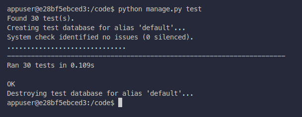

# Desafio Tinnova

## Desenvolver uma API JSON RESTful, que utilize todos os métodos (GET, POST, PUT, PATCH, DELETE).

### Modelo de dados
    veiculo:   string
    marca:     string
    ano:       integer
    descricao: text
    vendido:   bool
    created:   datetime
    updated:   datetime

## Stack que utilizei:

- Docker
- Python
- Django
- PostgreSQL
- Django REST Framework

## Variáveis de ambiente

    DEBUG=
    SECRET_KEY=
    ALLOWED_HOSTS=
    DATABASE_URL=
    DB_ENGINE=
    DB_NAME=
    DB_USER=
    DB_PASSWORD=
    DB_HOST=
    DB_PORT=

## Instalação via sistema

- Duplicar o arquivo de variáveis de ambiente e renomealo para .env e configurar as variáveis locais
	> cp .env.sample .env

- Instalar os requisitos
	> pip install -r requirements.txt

- Rodar as migrações para criar as tabelas no banco de dados
	> python manage.py migrate
- Semear o banco de dados
	> python manage.py loaddata veiculos.json

- Subir o servidor local
	> python manage.py runserver

## Instalação via Docker

- Duplicar o arquivo de variáveis de ambiente e renomealo para .env e configurar as variáveis locais
	> cp .env.sample .env

- Fazer o build das imagens
	> docker compose build

- Subir os containers
	> docker compose up

- Semear o banco de dados
	> docker compose exec web python manage.py loaddata veiculos.json

## Testes
- Rodar testes com Docker
    > docker compose exec web python manage.py test

# Evidências de testes

## Swagger do projeto

- [Swagger](http://localhost:8000/swagger/)

## DRF

- [Veículos](http://localhost:8000/veiculos/)

## Demais desafios

### Fatorial
    > python fatorial.py

### Ordenacão Bubble Sort
    > python ordenacao.py

### Multiplos
    > python multiplos.py

### Percentual de votos
    > python votos.py